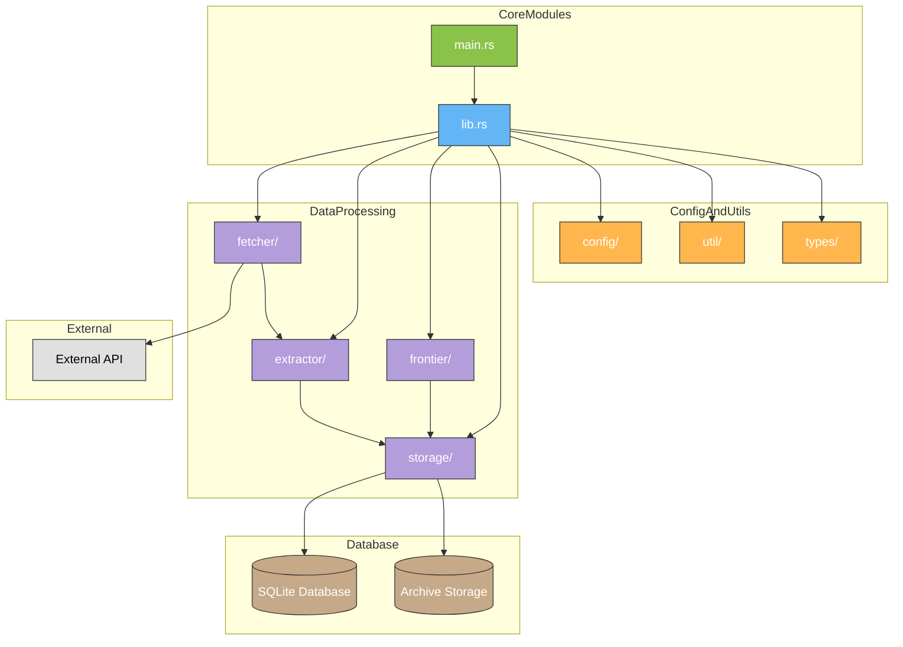

```mermaid
graph TD
    %% Core Modules
    subgraph CoreModules
        Main[main.rs]
        Lib[lib.rs]
    end

    %% Config and Utilities
    subgraph ConfigAndUtils
        Config[config/]
        Util[util/]
        Types[types/]
    end

    %% Data Processing Components
    subgraph DataProcessing
        Frontier[frontier/]
        Extractor[extractor/]
        Fetcher[fetcher/]
        Storage[storage/]
    end

    %% Database Layer
    subgraph Database
        DB[(SQLite Database)]
        Archive[(Archive Storage)]
    end

    %% Connections
    Main --> Lib
    Lib --> Config
    Lib --> Util
    Lib --> Types
    Lib --> Frontier
    Lib --> Extractor
    Lib --> Fetcher
    Lib --> Storage
    
    Frontier --> Storage
    Extractor --> Storage
    Fetcher --> Extractor
    Storage --> DB
    Storage --> Archive
    
    %% External Dependencies
    subgraph External
        ExternalAPI[External API]
    end
    
    Fetcher --> ExternalAPI
    
    %% Data Flow Annotations (softer palette)
    style Main fill:#8BC34A,stroke:#333,color:#fff
    style Lib fill:#64B5F6,stroke:#333,color:#fff
    style Config fill:#FFB74D,stroke:#333,color:#fff
    style Util fill:#FFB74D,stroke:#333,color:#fff
    style Types fill:#FFB74D,stroke:#333,color:#fff
    style Frontier fill:#B39DDB,stroke:#333,color:#fff
    style Extractor fill:#B39DDB,stroke:#333,color:#fff
    style Fetcher fill:#B39DDB,stroke:#333,color:#fff
    style Storage fill:#B39DDB,stroke:#333,color:#fff
    style DB fill:#C6A988,stroke:#333,color:#fff
    style Archive fill:#C6A988,stroke:#333,color:#fff
    style ExternalAPI fill:#E0E0E0,stroke:#333,color:#000
```

N.B.
* Generated on 15/March/2026
* Model: Qwen3
* Prompt: Carefully examine all the rust source code, and produce a full C4 architecture diagram for the system. 
